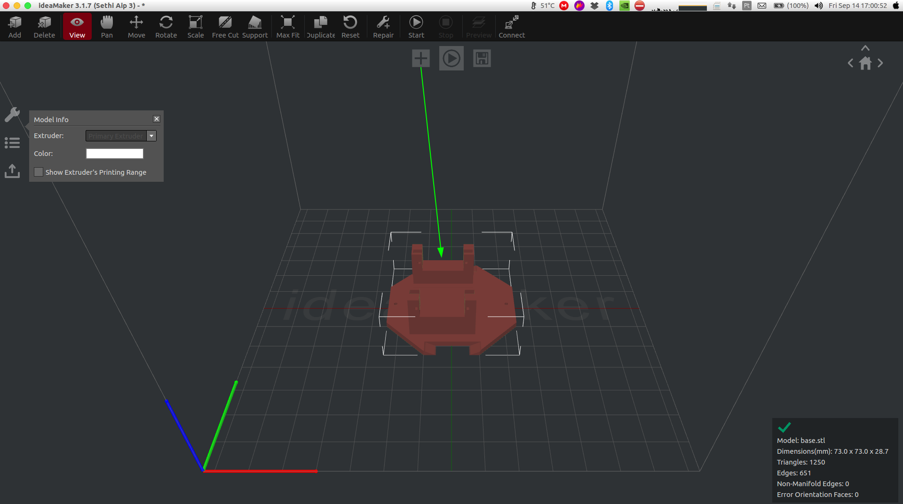
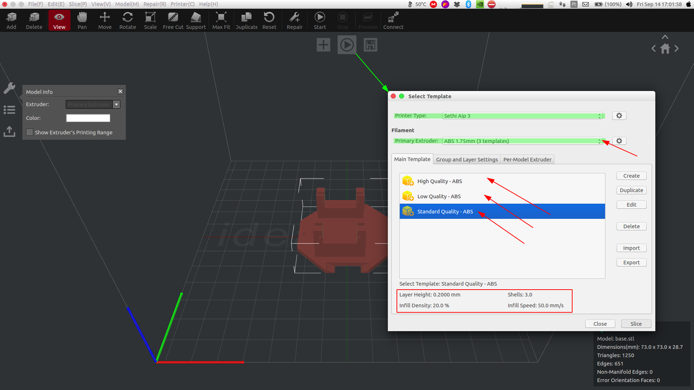
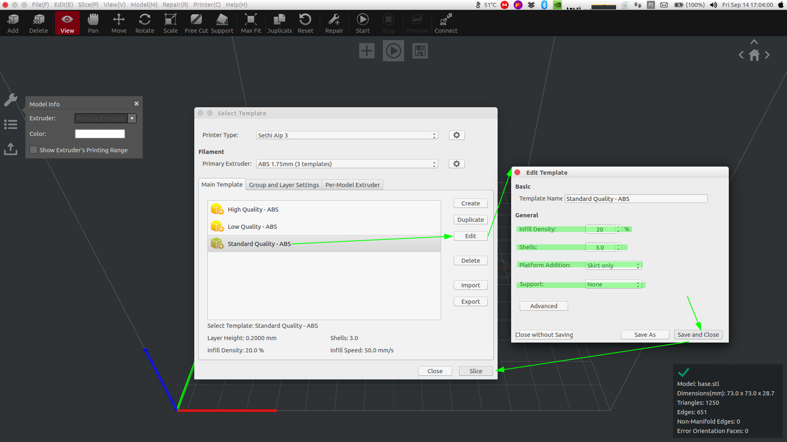
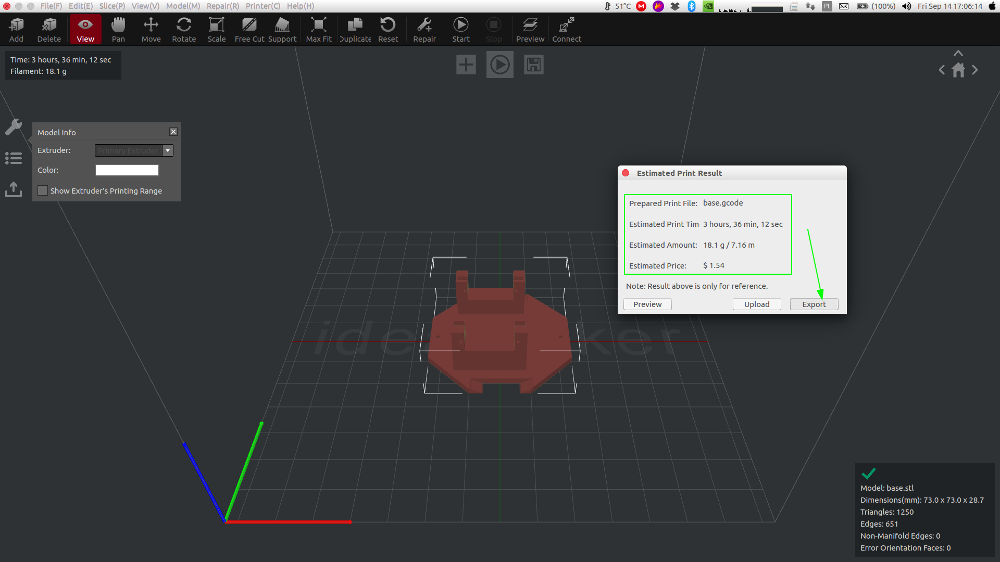
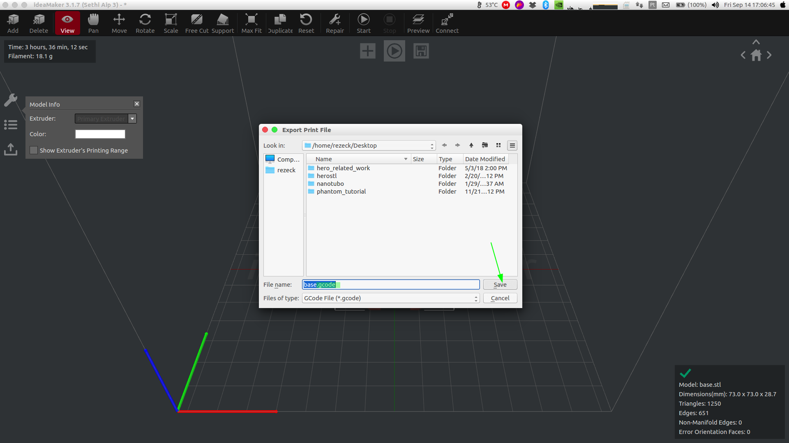
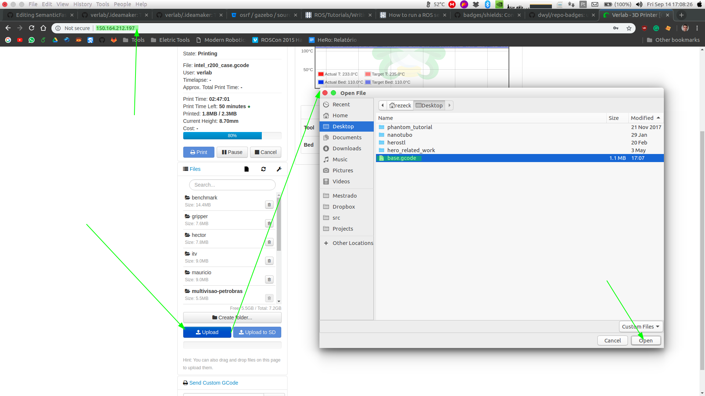
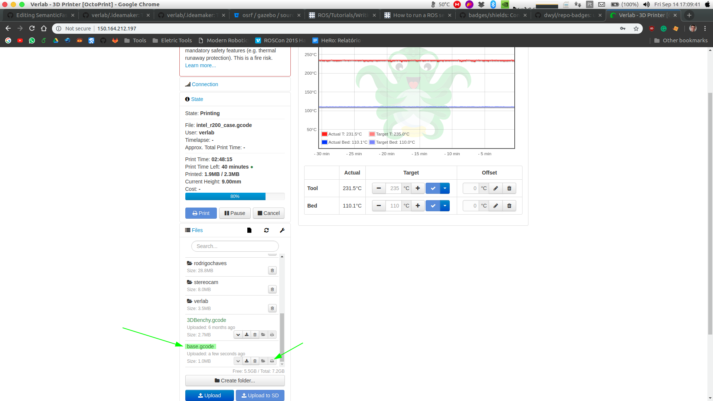

# 3D Printer Setup Files

[](LICENSE)

This repository is used to share configuration file of our 3D printer.

# Dependencies
* [Ideamaker 3.1.7 (Stable Version)](https://www.raise3d.com/pages/download)
* Install this repo:
```sh
$ cd ~
$ rm -rf .ideamaker # remove default configuration file 
$ git clone https://github.com/verlab/.ideamaker.git
```

# Usage 101
## 1 Step (Import Model)
* Open the ideamaker slicer:
```sh
$ ideamaker
```
* Add a 3D model usign stl format


## 2 Step (Slice Model)
* Click on Slice Button
* Check if the printer type
* Select the filament and the quality 


## 3 Step (Infill Model)
* Select the better infill density and platform adhesion types
* Save and click on slice button


## 4 Step (Export Model)
* Check the estimates
* Click on Export

* Save to gcode format


## 5 Step (Printing)
* Open the browser and type the local address of the printer
* Log the user with password
* Upload the exported file in gcode format

* Click on the imported file and finally click on print button


# Tested Configurations
> **Please, feel free to report any issue.**
## ABS
- [ ] High Quality - ABS
- [x] Standard Quality - ABS
- [x] Low Quality - ABS

## PLA
- [ ] High Quality - ABS
- [ ] Standard Quality - ABS
- [ ] Low Quality - ABS

## PETG
- [ ] High Quality - ABS
- [ ] Standard Quality - ABS
- [ ] Low Quality - ABS

## Institution ##

Federal University of Minas Gerais (UFMG)  
Computer Science Department  
Belo Horizonte - Minas Gerais -Brazil 

## Laboratory ##


**VeRLab:** Laboratory of Computer Vison and Robotics   
https://www.verlab.dcc.ufmg.br
